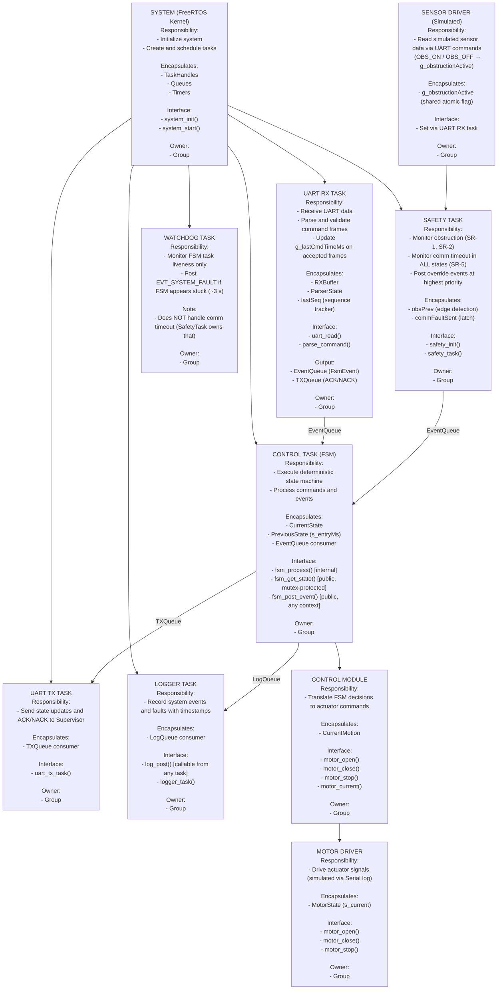

# Elevator Door Control System — System Architecture and Control Hierarchy

---

## Hierarchy of Control Diagram

---

## Dependency Constraints

**Allowed:**
- `UART_RX` → `ControlTask` (via EventQueue)
- `ControlTask` → `UART_TX` (via TXQueue)
- `ControlTask` → `MotorDriver` (direct call from FSM entry actions)
- `ControlTask` → `Logger` (via log_post / LogQueue)
- `SafetyTask` → `ControlTask` (via EventQueue, fsm_post_event)
- `SafetyTask` → `ControlTask` (read-only via fsm_get_state, mutex-protected)
- `SensorDriver` (UART RX) → `SafetyTask` (via g_obstructionActive atomic flag)
- All modules → `Logger` (write-only via log_post, non-blocking)
- `Watchdog` → `ControlTask` (via EventQueue, EVT_SYSTEM_FAULT only)

**Forbidden:**
- Tasks directly accessing each other's internal state
- `SafetyTask` directly controlling `MotorDriver` (must go through FSM)
- `UART_RX` directly triggering actuator commands
- `Logger` influencing control flow or state
- Shared mutable global variables across tasks (except atomically-guarded flags)
- Dynamic memory allocation at runtime

**Global State Policy:**
- The `ControlTask` (FSM) is the single owner of `CurrentState`.
- All inter-task communication is strictly via FreeRTOS queues and atomic flags.
- `g_obstructionActive` and `g_lastCmdTimeMs` are the only shared flags; all writes use `portENTER_CRITICAL`.
- Drivers are stateless from the FSM's perspective; FSM owns the authoritative state.

---

## Behavioral Mapping

| Module       | Related States                               | Related Transitions                                | Related Sequence Diagrams |
|--------------|----------------------------------------------|----------------------------------------------------|---------------------------|
| ControlTask  | ALL                                          | ALL                                                | All SDs                   |
| SafetyTask   | `FAULT`, `OPENING`, `CLOSING`                | `ObstructionDetected`, `SensorFault`, `CommTimeout`| SD-3, SD-7                |
| UART_RX      | None                                         | Command input                                      | SD-2, SD-4                |
| UART_TX      | None                                         | State output                                       | SD-2                      |
| MotorDriver  | None                                         | Actuation                                          | All                        |
| SensorDriver | None                                         | Sensor input (simulated)                           | SD-3                      |
| Logger       | None                                         | Logs transitions and faults                        | All                        |
| Watchdog     | None                                         | EVT_SYSTEM_FAULT if FSM stuck                      | None                       |

---

## Interaction Summary

| Module       | Communicates With              | Method                          | Shared Data? |
|--------------|-------------------------------|----------------------------------|--------------|
| UART_RX      | ControlTask                   | FreeRTOS Queue (EventQueue)      | No           |
| UART_RX      | SafetyTask                    | Atomic flag (g_obstructionActive)| Atomic write |
| ControlTask  | SafetyTask                    | Mutex snapshot (fsm_get_state)   | No           |
| ControlTask  | MotorDriver                   | Direct call (entry actions)      | No           |
| ControlTask  | UART_TX                       | FreeRTOS Queue (TXQueue)         | No           |
| ControlTask  | Logger                        | log_post (LogQueue)              | No           |
| SafetyTask   | ControlTask                   | FreeRTOS Queue (EventQueue)      | No           |
| Watchdog     | ControlTask                   | FreeRTOS Queue (EventQueue)      | No           |
| SensorDriver | SafetyTask                    | Atomic flag (g_obstructionActive)| Atomic read  |
| Logger       | None (write-only sink)        | —                                | No           |

Coupling is hierarchical and strictly controlled. No module holds a reference to another module's internal state.

---

## Architectural Rationale

### Organizational Style: Distributed Real-Time Control (RTOS-Based)

The architecture follows a Supervisor–Controller model utilizing task-based execution (FreeRTOS) and message-passing communication. Control authority is centralized in the `ControlTask` (FSM), while safety enforcement, sensor reading, and communication are handled by independent, isolated tasks.

### Key Design Decisions

**Command-Based Communication**
The Supervisor sends explicit `CMD=OPEN`, `CMD=CLOSE`, and `CMD=EMERGENCY_OPEN` commands rather than raw signals. This eliminates input ambiguity, ensures deterministic FSM behavior, and decouples the controller from the physical triggering source.

**FSM-Centric Control**
The `ControlTask` serves as the single source of truth for system state. All state transitions are validated centrally through the FSM. No other task may modify `CurrentState` directly.

**Safety Isolation**
The `SafetyTask` runs as an independent, highest-priority task. It has the authority to issue override events to the `ControlTask` without depending on UART input, logging, or any other non-critical task. This ensures that obstruction handling and communication timeouts are responded to within bounded time regardless of system load.

**Communication Timeout Ownership (SR-5)**
The `SafetyTask` is the sole authoritative monitor of communication timeout. It monitors `g_lastCmdTimeMs` in ALL states (not just motion states), and posts `EVT_COMM_TIMEOUT` when the threshold is exceeded. The Watchdog task monitors only FSM liveness (deadlock detection) and does NOT duplicate comm-timeout logic. This clean separation prevents duplicate fault events and ensures the highest-priority task enforces SR-5.

**Command Priority Enforcement (FR-3)**
The FSM enforces the command priority rule `EMERGENCY_OPEN > OPEN > CLOSE` structurally:
- `EVT_CMD_EMERGENCY_OPEN` is handled before any state dispatch.
- `EVT_CMD_OPEN` preempts `CLOSING` (OPENING entry action is triggered immediately).
- `EVT_CMD_CLOSE` is **rejected** (logged, no state change) during `OPENING`. This is consistent with the priority rule: a lower-priority command cannot interrupt a higher-priority motion in progress.

**OPENING + COMM_TIMEOUT → FAULT (SR-5)**
The previous design allowed `COMM_TIMEOUT` during `OPENING` to be silently ignored ("safer to finish opening"). This was corrected: SR-5 requires the system to stop all motion and enter a safe state on communication loss, regardless of the current motion direction. The FSM now transitions to `FAULT` on `COMM_TIMEOUT` in all motion states.

**Queue-Based Inter-Task Communication**
All communication between tasks uses FreeRTOS queues and event groups. This eliminates shared memory, prevents race conditions, and ensures that task failures are contained and do not corrupt the state of other tasks.

**Timing Isolation**
Control logic execution is entirely unaffected by UART transmission delays, logging operations, or debug instrumentation. Non-critical task delays do not propagate to the `ControlTask` or `SafetyTask`.

System control authority resides in: **ControlTask (FSM)**
System state is owned by: **ControlTask (FSM)**

---

## Task Split

| Member | Module(s) Owned                            |
|--------|--------------------------------------------|
| 1      | Safety Task                                |
| 2      | Sensor Driver (simulated via UART RX)      |
| 3      | UART RX Task + UART TX Task + Logger Task  |
| 4      | Motor Driver                               |
| 5      | Control Task (FSM)                         |
| Group  | System Initialization + Integration + Watchdog |

---

## Module: Control Task / FSM
*(Group Core Module)*

### Purpose and Responsibilities

- Own the authoritative door state (`CurrentState`).
- Validate all state transitions and enforce behavioral rules.
- Coordinate the `SafetyTask`, `MotorDriver`, `UART_TX`, and `Logger` modules.
- Process incoming events from the `EventQueue` (commands from `UART_RX`, override events from `SafetyTask`).
- Ensure deterministic, bounded execution under FreeRTOS fixed-priority scheduling.

### Inputs

- **Events received via FreeRTOS EventQueue:**
  - `CMD=OPEN`, `CMD=CLOSE`, `CMD=STOP`, `CMD=EMERGENCY_OPEN` (from `UART_RX`)
  - `RESET` (from `UART_RX`)
  - `ObstructionDetected`, `CommTimeout` (from `SafetyTask`)
  - `SensorFault`, `SystemFault` (from `SafetyTask` / Watchdog)
  - `DoorFullyOpen`, `DoorFullyClosed` (self-generated simulation timer)

- **Assumptions about inputs:**
  - All commands arriving at the `EventQueue` from `UART_RX` have been CRC-validated.
  - `SafetyTask` has evaluated sensor conditions before issuing override events.

### Outputs

- **Commands issued:**
  - `motor_open()`, `motor_close()`, `motor_stop()` → to `MotorDriver` (direct call in entry actions)
  - State frames via `TXQueue` → to `UART_TX`
  - Log entries via `log_post()` → to `Logger`

- **Guarantees provided:**
  - Only valid state transitions occur.
  - `FAULT` is reachable from any state and overrides all operations.
  - `EMERGENCY` is reachable from any state and overrides all operations.
  - Invalid or redundant commands are logged and rejected without state change.
  - No motion command is issued without passing transition validation.

### Internal State (Encapsulation)

- **State variables:**
  - `s_state`: `IDLE`, `OPENING`, `OPEN`, `CLOSING`, `CLOSED`, `STOPPED`, `EMERGENCY`, `FAULT`
  - `s_entryMs`: timestamp of last state entry (for motion simulation timer)
  - `s_motionEvtPosted`: prevents duplicate motion-completion events

- **Configuration parameters:**
  - `DOOR_MOTION_SIM_MS` (motion simulation duration)
  - `STATE_REPORT_INTERVAL_MS` (periodic TX rate, 100 ms)
  - `FSM_TASK_PERIOD_MS` (task loop period, 10 ms)

- **Internal invariants:**
  - Only one state is active at any time.
  - Motion states (`OPENING` / `CLOSING`) require a corresponding validated entry command.
  - `FAULT` overrides and blocks all motion states.
  - `EMERGENCY` overrides all states; `CMD=CLOSE` is rejected in `EMERGENCY`.
  - Stop-before-reverse is enforced implicitly by entry actions (`motor_stop()` is the entry action for all non-motion states).

### Initialization / Deinitialization

- **Init requirements:**
  - Set `s_state` = `STATE_IDLE`
  - Issue `motor_stop()` as safe default on startup
  - Seed `g_lastCmdTimeMs` to prevent false comm-timeout fault at boot

- **Shutdown behavior:**
  - Issue `motor_stop()`

- **Reset behavior:**
  - Transition to `STATE_IDLE`
  - Require explicit `CMD=OPEN` or `CMD=CLOSE` before any motion resumes (SR-4)

### Basic Protection Rules

- **Inputs validated:**
  - Valid event types (enumerated `FsmEvent`)
  - Legal state transition combinations per the FSM transition table

- **Invalid conditions rejected:**
  - `CMD=CLOSE` when already in `CLOSING` or `CLOSED` state (redundant, logged)
  - `CMD=CLOSE` when in `OPENING` state (priority rejection, FR-3)
  - `CMD=CLOSE` when in `EMERGENCY` state (safety rejection, SR-6)
  - `CMD=OPEN` when already in `OPENING` or `OPEN` state (redundant, logged)
  - Any motion command while in `FAULT` state (logged and ignored)

- **Error escalation:**
  - All invalid inputs and fault events are logged via `Logger`
  - Unrecoverable or safety-critical conditions transition system to `FAULT`

### Module-Level Tests

| Test ID | Purpose                                      | Stimulus                                    | Expected Outcome                          |
|---------|----------------------------------------------|---------------------------------------------|-------------------------------------------|
| FSM-1   | Valid open transition                        | State = `IDLE` + `CMD=OPEN`                 | Transition to `OPENING`                   |
| FSM-2   | Reject duplicate open                        | State = `OPEN` + `CMD=OPEN`                 | Command logged, state unchanged           |
| FSM-3   | Fault override from any state                | Any state + `SensorFault`                   | Transition to `FAULT`                     |
| FSM-4   | Obstruction during closing                   | State = `CLOSING` + `ObstructionDetected`   | Transition to `OPENING`                   |
| FSM-5   | Emergency override during close              | State = `CLOSING` + `CMD=EMERGENCY_OPEN`    | Transition to `EMERGENCY`                 |
| FSM-6   | Communication timeout during motion          | State = `OPENING`/`CLOSING` + `CommTimeout` | Transition to `FAULT`                     |
| FSM-7   | No auto-motion after reset                   | `RESET` from `FAULT`                        | Transition to `IDLE`, no motion           |
| FSM-8   | CMD=CLOSE rejected during OPENING            | State = `OPENING` + `CMD=CLOSE`             | Command rejected, state unchanged (FR-3)  |
| FSM-9   | CMD=CLOSE rejected in EMERGENCY              | State = `EMERGENCY` + `CMD=CLOSE`           | Command rejected, door stays open (SR-6)  |
| FSM-10  | CMD=OPEN preempts CLOSING                    | State = `CLOSING` + `CMD=OPEN`              | Transition to `OPENING` (FR-3)            |

---

## Gap and Risk Analysis

### High-Risk Areas

**Real-Time Guarantee (WCET)**
The worst-case execution time (WCET ≤ 10 ms) has not yet been formally measured or verified. Task execution timing under full system load is currently unknown.
Mitigation: Add timing instrumentation to critical tasks; use `vTaskDelayUntil()` for periodic execution; instrument FSM transitions.

**Queue Overflow**
The `EventQueue` may overflow under UART burst traffic conditions.
Mitigation: `EVT_QUEUE_SIZE = 20`; overflow is logged and the dropped event is reported. Consider increasing queue size if burst traffic is expected.

**Priority Inversion (RTOS)**
Lower-priority tasks could potentially block higher-priority tasks if mutexes are misused.
Mitigation: `g_stateMutex` is held for the minimum required duration. Queue-based communication is preferred throughout. FreeRTOS mutex priority inheritance is enabled by default on ESP32.

**Communication Reliability**
UART frame loss and corruption rates are not formally bounded.
Mitigation: CRC-8 validation and sequence numbering are enforced. `NACK` is sent on any error. Comm-timeout triggers `FAULT` after `COMM_TIMEOUT_MS`.

**Sensor Fault Classification**
The criteria for classifying a sensor reading as faulty are not formally defined (simulation only; obstruction is a binary flag).
Mitigation: In hardware, define strict sensor validity rules with explicit timeout thresholds and contradiction detection logic in the `SafetyTask`.

### Medium Risks

- Logging latency from the `Logger` task has not been bounded; under load it may drop messages silently.
- Watchdog recovery logic after a watchdog expiry posts `EVT_SYSTEM_FAULT`, which transitions the FSM to `FAULT`. A subsequent `RESET` is required to resume; no auto-recovery.
- The heartbeat protocol (interval, format, expected supervisor behavior) is not formally defined beyond the `COMM_TIMEOUT_MS` threshold.

### Resolved Issues (from Previous Version)

- **OPENING + COMM_TIMEOUT**: Previously silently ignored ("safer to finish"). Now correctly transitions to `FAULT` in compliance with SR-5.
- **CMD=CLOSE during OPENING**: Previously allowed as a preemption. Corrected to rejection per FR-3 command priority (`OPEN > CLOSE`).
- **Watchdog duplicate comm-timeout**: Previously the watchdog also posted `EVT_COMM_TIMEOUT`, creating potential duplicate fault events. Now the watchdog handles FSM liveness only; `SafetyTask` exclusively owns comm-timeout monitoring.
- **STATE_REPORT_INTERVAL_MS**: Corrected from 200 ms to 100 ms to satisfy T-4 (≥5 state reports/second) and FR-5 ("e.g. every 50 ms").

### Low Risks

- The modular task structure is well-defined and supports isolation.
- FSM design is deterministic and fully specified.
- Safety layering via the independent `SafetyTask` is correctly implemented.
