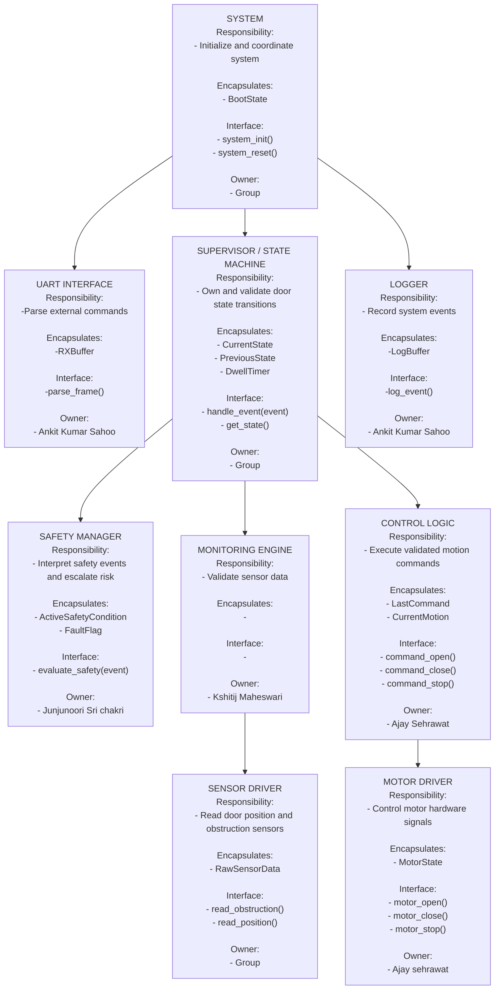

## Hierarchy of Control Diagram

---

## Dependency Constraints

Allowed:
- UART → Supervisor
- Supervisor → Safety
- Supervisor → Monitoring
- Supervisor → Control
- Monitoring → SensorDriver
- Control → MotorDriver
- All modules → Logger (write-only)

Forbidden:
- Drivers calling upward
- Safety commanding MotorDriver directly
- Monitoring commanding Control directly
- UART issuing motor commands
- Logger influencing state
- Shared mutable global variables

Global State Policy:
- Only Supervisor owns CurrentState.
- No shared mutable global variables.
- Modules communicate via explicit function calls or events.
- Drivers do not access Supervisor internals.

---

## Behavioral Mapping

| Module | Related States | Related Transitions | Related Sequence Diagrams |
|--------|---------------|--------------------|---------------------------|
| Supervisor | OPEN, CLOSED, OPENING, CLOSING, STOPPED, FAULT | All | All |
| Safety | FAULT, STOPPED | ObstructionDetected, EmergencyStop, SensorFault | Obstruction handling|
| Control | OPENING, CLOSING| ValidOpen, ValidClose | Normal open/close |
| Monitoring | None (observer) | SensorTimeout, InconsistentData | Fault scenarios |
| MotorDriver | None | Actuation | All |
| SensorDriver | None | Sensor Input | All |
|Logger | None | Logs transitions | All|
|UART | None | OpenReq, CloseReq | Input handling |

---

## Interaction Summary

| Module | Calls | Called By | Shared Data? |
|--------|-------|----------|-------------|
| Supervisor | Safety, Monitoring, Control, Logger | UART | No |
| Safety | None (returns decision only) | Supervisor | No |
| Control | MotorDriver | Supervisor | No |
| Monitoring | SensorDriver | Supervisor | No |
| Logger | None | All | No |
| Drivers | None | Control / Monitoring | No |
| UART | Supervisor | System | No |

- Coupling is hierarchical and controlled.
---

## Architectural Rationale

### Organizational Style: Coordinated Controllers

The architecture follows a coordinated controller model:

- A central Supervisor / State Manager owns system state.
- Functional modules (Control, Monitoring) coordinate through it.
- Safety logic evaluates risk and influences state transitions.
- Hardware drivers are strictly bottom-layer.
- Logging is passive and non-intrusive.

System control authority resides in: **Supervisor / State Manager**  
System state is owned by: **Supervisor / State Manager**

Safety logic is separated from normal control so that faults can override operation without depending on UART input, drivers, or logging modules.

---

## Task Split

| Member | Module(s) Owned |
|--------|------------------|
|Junjunoori Sri Chakri | Safety Manager |
| Kshitij Maheswari | Monitoring Engine |
| Ankit Kumar Sahoo | UART Interface + Logger |
| Ajay Sehrawat | CControl Logic + Motor Driver |
| Shared | Supervisor / State Machine |

## Module: Supervisor / State Machine
(Group Core Module)

### Purpose and Responsibilities
- Own the authoritative door state.
- Validate all state transitions.
- Enforce behavioral rules.
- Coordinate Safety, Monitoring, and Control modules.
- Ensure deterministic behavior.

### Inputs
- Events received:
  - OpenRequest
  - CloseRequest
  - SafetyStopRequest
  - FaultEvent
  - ObstructionDetected
  - DoorFullyOpen
  - DoorFullyClosed
  - ResetRequest
- Data received:
  - SSafety condition status (from Safety Manager)
  - Sensor anomaly flags (from Monitoring Engine)
- Assumptions about inputs:
   - Events are well-formed.
   - Monitoring Engine has already validated raw sensor data.

### Outputs
- Events emitted:
  - None (Supervisor does not broadcast events)
- Commands issued:
  - command_open()
  - command_close()
  - command_stop()
  - log_event()
- Guarantees provided:
  - Only valid state transitions occur.
  - FAULT is reachable from any state.
  - Invalid transitions are rejected.
  - No motion occurs without explicit transition validation.

### Internal State (Encapsulation)
- State variables:
  - CurrentState (OPEN, CLOSED, OPENING, CLOSING, STOPPED, FAULT)
  - PreviousState
  - DwellTimer
- Configuration parameters:
  - TransitionTable
  - MinimumDwellTime
- Internal invariants:
  - Only one state active at a time.
  - Cannot be OPEN and CLOSING simultaneously.
  - Motion states (OPENING/CLOSING) require corresponding command.
  - FAULT overrides all states.

### Initialization / Deinitialization
- Init requirements:
   - Set CurrentState = CLOSED (or STOPPED depending on system boot assumption)
  - Clear PreviousState
  - Reset DwellTimer
- Shutdown behavior:
  - Issue command_stop()
  - Preserve last safe state if required
- Reset behavior:
  - Transition to STOPPED
  - Clear active faults

### Basic Protection Rules (Light Safeguards)

- What inputs are validated?
  - Valid event types
  - Legal transition combinations
- What invalid conditions are rejected?
  - OPEN request when already OPEN
  - CLOSE request when already CLOSED
  - Motion request during FAULT
- What invariants are enforced?
  - State machine integrity
  - No transition bypasses validation
  - Stop-before-reverse rule enforced via Control
- Where are errors escalated?
  - Logged via Logger
  - Critical inconsistencies move system to FAULT
Full fault handling is NOT required yet.

### Module-Level Tests

| Test ID | Purpose | Stimulus | Expected Outcome |
|--------|---------|----------|------------------|
| SUP-1 |Valid open transition | CLOSED + OpenRequest | Transition to OPENING|
| SUP-2 | Reject duplicate open | OPEN + OpenRequest | Ignored |
| SUP-3 | Fault override | Any state + FaultEvent | Transition to FAULT |
| SUP-4 | Obstruction during close | CLOSING + ObstructionDetected | STOPPED |

---
