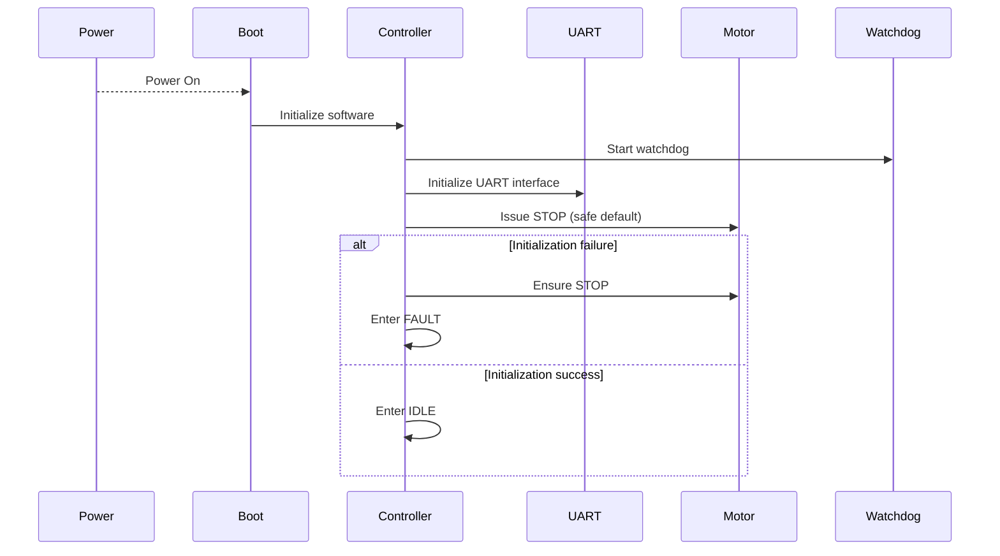
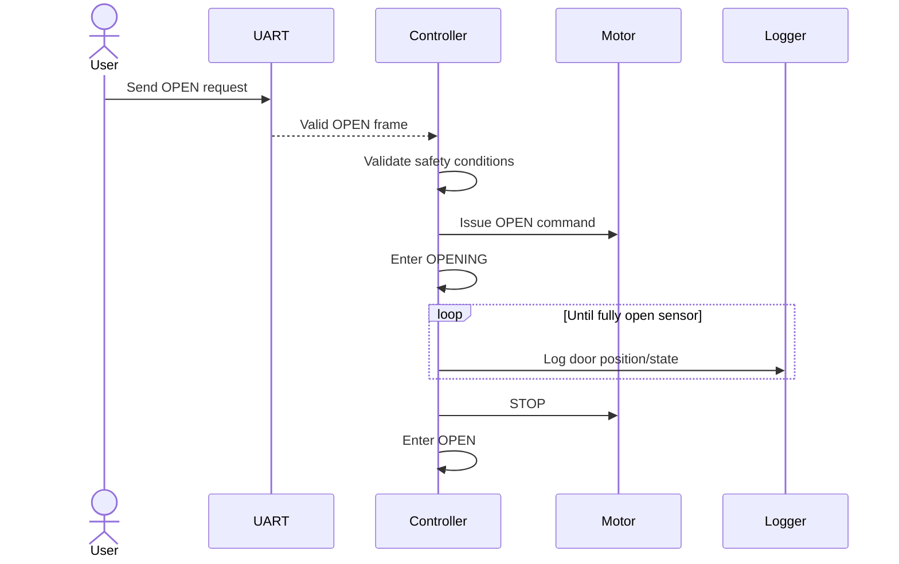
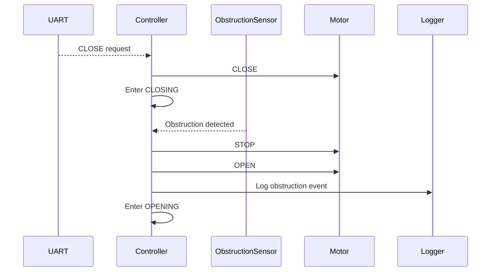
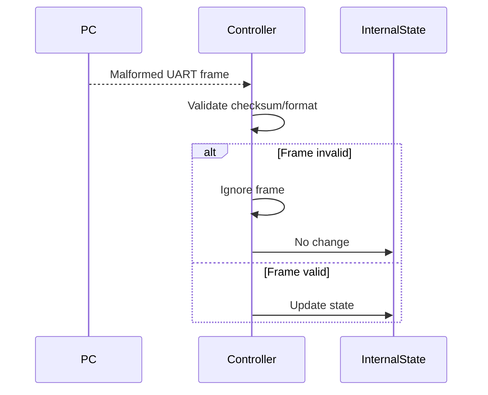
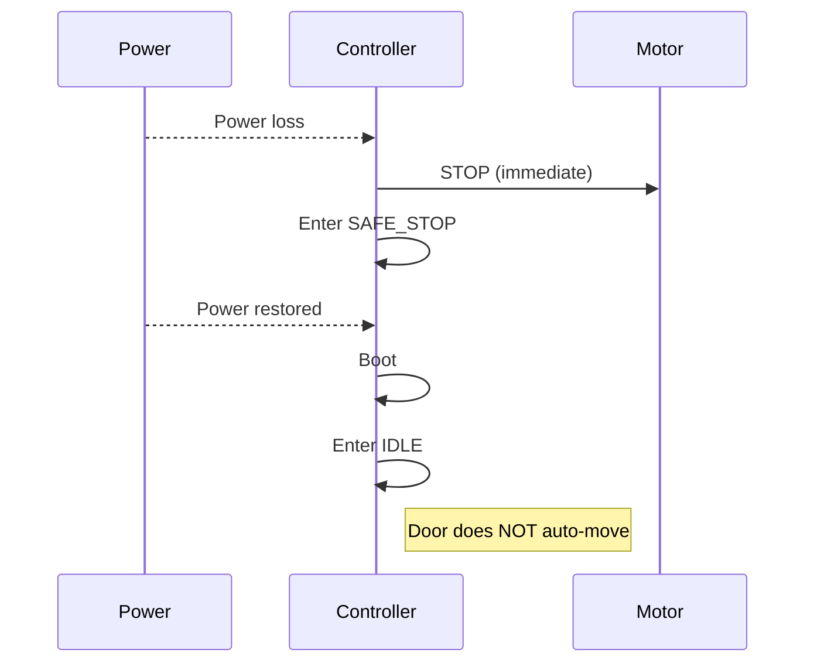

## 1. Key Sequence Diagrams

### SD-1: System Start-up

---

### SD-2: Normal Door Opening

---

### SD-3: Safety-Critical – Obstruction During Closing

---

### SD-4: Invalid UART Frame Handling

### SD-5: Power Loss and Recovery

---

## 2. Traceability Matrix

| Requirement | Statechart Element(s) | Sequence Diagram(s) | Test ID |
|------------|------------------------|----------------------|---------|
| R-1 Valid UART only | IDLE, OPENING, CLOSING | SD-4 | T-1 |
| R-2 No closing on obstruction | CLOSING → OPENING| SD-3 | T-2 |
| R-3 Safe open on request| IDLE, OPENING | SD-2 | T-3 |
| R-4 Fault on contradictory sensors | FAULT| SD-3 | T-4 |
| R-5 Stop on power loss | SAFE_STOP | SD-5 | T-5 |

---

## 3. Test Plan

The tests are **design-level** and do not include implementation details.

## T-1: Valid UART Frame Handling

**Related Requirements**
- R-1: Update internal state only on valid UART frame  

**Purpose**  
Ensure corrupted or malformed UART inputs do not affect controller state.

**Preconditions**
- System in IDLE
- UART interface active

**Stimulus**
- Send malformed UART frame
- Send valid UART frame

**Test Steps**
1. Send malformed frame (bad checksum or missing field)
2. Observe controller state
3. Send valid frame
4. Observe controller state

**Observations / Measurements**
- State transitions
- Motor command output

**Expected Outcome**
- No state change for invalid frame
- State updates only for valid frame

**Pass/Fail Criteria**
- PASS if invalid frames are ignored
- FAIL if controller changes state on malformed input

---

## T-2: Obstruction During Closing

**Related Requirements**
- R-2: Never remain in CLOSING when obstruction active 

**Purpose**  
Ensure obstruction immediately preempts closing motion.

**Preconditions**
- Door in CLOSING
- Obstruction sensor operational

**Stimulus**
- Activate obstruction signal

**Test Steps**
1. Send CLOSE command
2. Verify door enters CLOSING
3. Trigger obstruction
4. Observe motor commands

**Observations**
- Time to STOP command
- Transition to OPENING
- Motor outputs

**Expected Outcome**
- STOP issued immediately
- OPEN issued after STOP
- System leaves CLOSING state

**Pass/Fail Criteria**
- PASS if no continued closing motion
- FAIL if door continues closing

---

## T-3: Normal Door Opening

**Related Requirements**
- R-3: Open door safely upon valid request

**Purpose**  
Verify correct behavior during normal opening.

**Preconditions**
- Door in CLOSED
- No obstruction or fault

**Stimulus**
- Send OPEN request

**Test Steps**
1. Send valid OPEN command
2. Observe transition to OPENING
3. Simulate fully-open sensor
4. Observe STOP command

**Observations**
- Motor commands
- State transitions

**Expected Outcome**
- OPEN command issued
- STOP when fully open
- State becomes OPEN

**Pass/Fail Criteria**
- PASS if sequence correct
- FAIL if unsafe or incorrect transition occurs

---

## T-4: Contradictory Sensor Fault

**Related Requirements**
- R-4: Enter FAULT on contradictory inputs

**Purpose**  
Ensure controller does not guess door position.

**Preconditions**
- System active.

**Stimulus**
- Send UART frame indicating both fully open and fully closed

**Test Steps**
1. Inject contradictory sensor frame
2. Observe state
3. Observe motor output

**Observations**
- State transition
- Motor commands

**Expected Outcome**
- System enters FAULT
- Motor remains STOP
- Ignores OPEN/CLOSE commands until reset

**Pass/Fail Criteria**
- PASS if safe halt occurs
- FAIL if system continues motion

---

## T-5: Power Loss Handling

**Related Requirements**
- R-5: Stop motion immediately on power loss 

**Purpose**  
Verify fail-safe behavior during unexpected power interruption.

**Preconditions**
- Door moving (OPENING or CLOSING)

**Stimulus**
- Remove power abruptly
- Restore power

**Test Steps**
1. Start door motion
2. Remove power
3. Restore power
4. Observe post-boot state

**Observations**
- Motor behavior during loss
- State after reboot

**Expected Outcome**
- Motor stops immediately
- System boots into IDLE
- No automatic door movement

**Pass/Fail Criteria**
- PASS if no auto-motion after reset
- FAIL if door resumes movement

---

> **Key takeaway:**  
> Every safety-critical requirement must be backed by an explicit, observable test.

---

## 4. Gap and Risk Analysis

- Obstruction detection latency not formally bounded.

- UART corruption frequency assumptions not quantified.

- Fault recovery policy (manual reset vs auto-clear) not clearly defined.

- No explicit timing constraints for STOP reaction.

- Power restoration behavior depends on hardware-level guarantees.