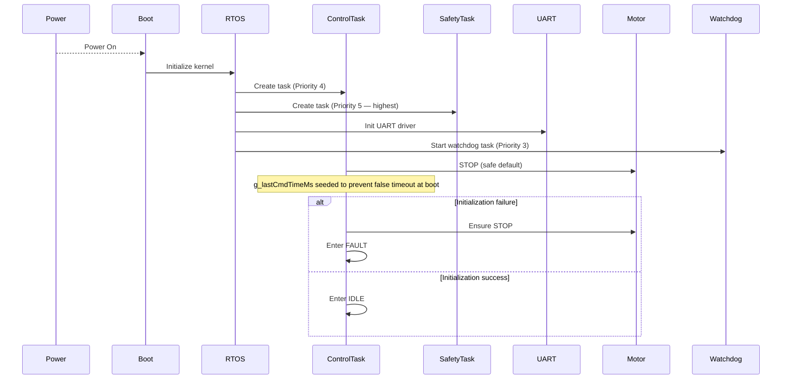
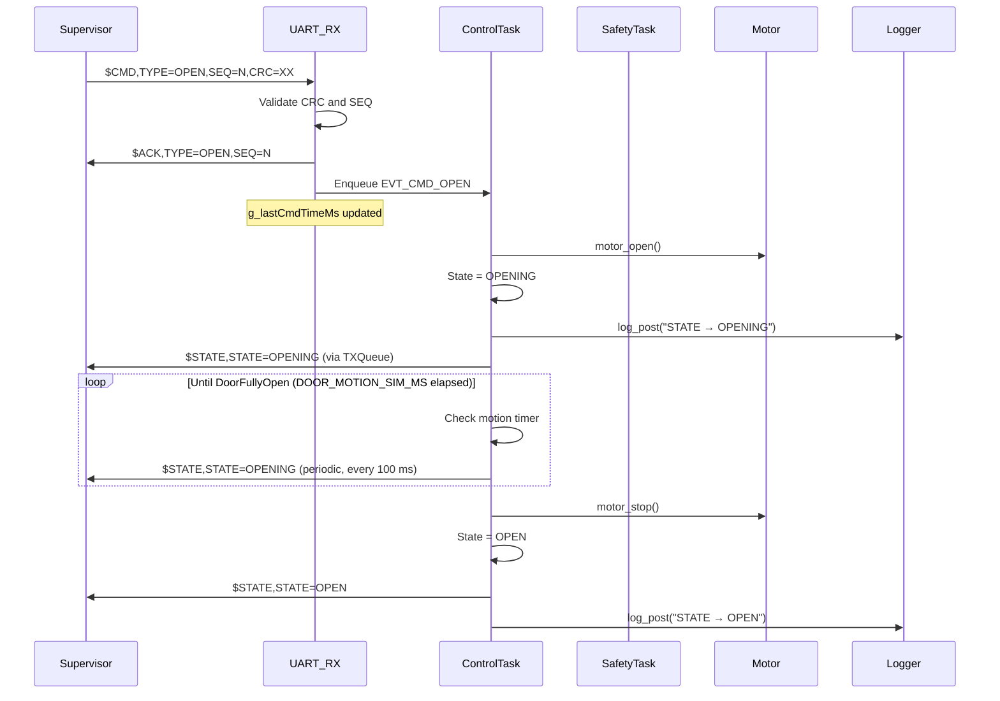
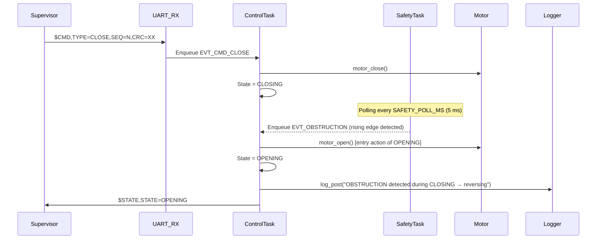
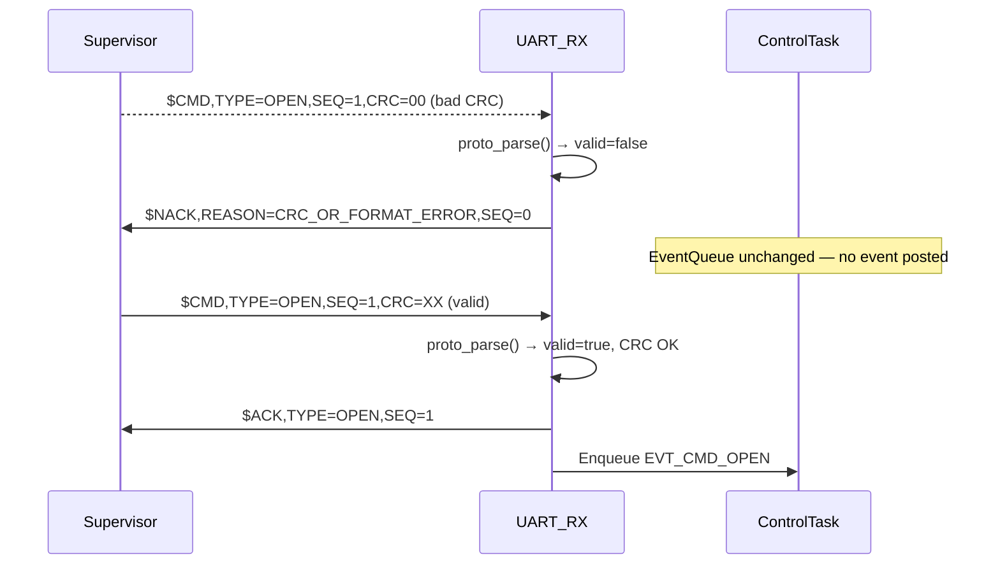
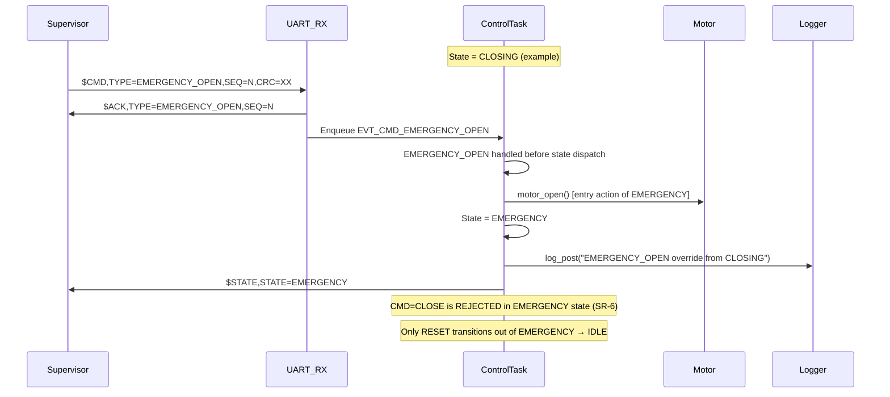
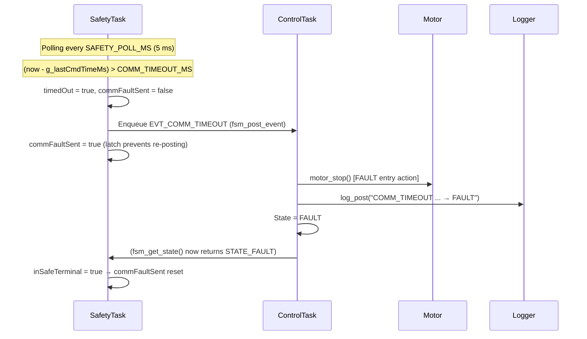
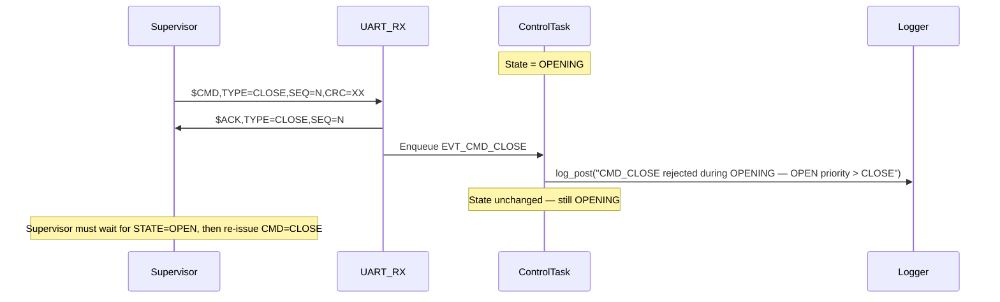

# Elevator Door Control System — Sequence Diagrams, Traceability, and Test Plan

---

## 1. Key Sequence Diagrams

### SD-1: System Start-up (FreeRTOS-Based)

```mermaid
sequenceDiagram
    participant Power
    participant Boot
    participant RTOS
    participant ControlTask
    participant SafetyTask
    participant UART
    participant Motor
    participant Watchdog

    Power-->>Boot: Power On
    Boot->>RTOS: Initialize kernel
    RTOS->>ControlTask: Create task (Priority 4)
    RTOS->>SafetyTask: Create task (Priority 5 — highest)
    RTOS->>UART: Init UART driver
    RTOS->>Watchdog: Start watchdog task (Priority 3)
    ControlTask->>Motor: STOP (safe default)
    Note over ControlTask: g_lastCmdTimeMs seeded to prevent false timeout at boot

    alt Initialization failure
        ControlTask->>Motor: Ensure STOP
        ControlTask->>ControlTask: Enter FAULT
    else Initialization success
        ControlTask->>ControlTask: Enter IDLE
    end
```

---

### SD-2: Command-Based Door Opening

```mermaid
sequenceDiagram
    participant Supervisor
    participant UART_RX
    participant ControlTask
    participant SafetyTask
    participant Motor
    participant Logger

    Supervisor->>UART_RX: $CMD,TYPE=OPEN,SEQ=N,CRC=XX
    UART_RX->>UART_RX: Validate CRC and SEQ
    UART_RX->>Supervisor: $ACK,TYPE=OPEN,SEQ=N
    UART_RX->>ControlTask: Enqueue EVT_CMD_OPEN
    Note over UART_RX: g_lastCmdTimeMs updated

    ControlTask->>Motor: motor_open()
    ControlTask->>ControlTask: State = OPENING
    ControlTask->>Logger: log_post("STATE → OPENING")
    ControlTask->>Supervisor: $STATE,STATE=OPENING (via TXQueue)

    loop Until DoorFullyOpen (DOOR_MOTION_SIM_MS elapsed)
        ControlTask->>ControlTask: Check motion timer
        ControlTask->>Supervisor: $STATE,STATE=OPENING (periodic, every 100 ms)
    end

    ControlTask->>Motor: motor_stop()
    ControlTask->>ControlTask: State = OPEN
    ControlTask->>Supervisor: $STATE,STATE=OPEN
    ControlTask->>Logger: log_post("STATE → OPEN")
```

---

### SD-3: Safety-Critical — Obstruction During Closing

```mermaid
sequenceDiagram
    participant Supervisor
    participant UART_RX
    participant ControlTask
    participant SafetyTask
    participant Motor
    participant Logger

    Supervisor->>UART_RX: $CMD,TYPE=CLOSE,SEQ=N,CRC=XX
    UART_RX->>ControlTask: Enqueue EVT_CMD_CLOSE

    ControlTask->>Motor: motor_close()
    ControlTask->>ControlTask: State = CLOSING

    Note over SafetyTask: Polling every SAFETY_POLL_MS (5 ms)
    SafetyTask-->>ControlTask: Enqueue EVT_OBSTRUCTION (rising edge detected)

    ControlTask->>Motor: motor_open() [entry action of OPENING]
    ControlTask->>ControlTask: State = OPENING
    ControlTask->>Logger: log_post("OBSTRUCTION detected during CLOSING → reversing")
    ControlTask->>Supervisor: $STATE,STATE=OPENING
```

*Note: `motor_stop()` is NOT called explicitly between CLOSING and OPENING. The `enter_state(STATE_OPENING)` entry action immediately calls `motor_open()`, which internally checks if the motor is already OPENING and only changes if needed. For hardware implementations requiring stop-before-reverse, insert an intermediate `STATE_STOPPED` transition with a brief delay.*

---

### SD-4: Invalid UART Frame Handling

```mermaid
sequenceDiagram
    participant Supervisor
    participant UART_RX
    participant ControlTask

    Supervisor-->>UART_RX: $CMD,TYPE=OPEN,SEQ=1,CRC=00 (bad CRC)
    UART_RX->>UART_RX: proto_parse() → valid=false
    UART_RX->>Supervisor: $NACK,REASON=CRC_OR_FORMAT_ERROR,SEQ=0

    Note over ControlTask: EventQueue unchanged — no event posted

    Supervisor->>UART_RX: $CMD,TYPE=OPEN,SEQ=1,CRC=XX (valid)
    UART_RX->>UART_RX: proto_parse() → valid=true, CRC OK
    UART_RX->>Supervisor: $ACK,TYPE=OPEN,SEQ=1
    UART_RX->>ControlTask: Enqueue EVT_CMD_OPEN
```

---

### SD-5: Power Loss and Recovery

```mermaid
sequenceDiagram
    participant Power
    participant ControlTask
    participant Motor
    participant RTOS

    Power-->>ControlTask: Power Loss (implicit — hardware cuts power)
    Note over Motor: Motor stops due to loss of power (hardware)

    Power-->>RTOS: Power Restored
    RTOS->>ControlTask: Reinitialize via setup()
    ControlTask->>Motor: motor_stop() (safe default in fsm_init)
    ControlTask->>ControlTask: State = IDLE
    Note over ControlTask: g_lastCmdTimeMs seeded; no automatic motion (SR-4)
```

---

### SD-6: Emergency Override

```mermaid
sequenceDiagram
    participant Supervisor
    participant UART_RX
    participant ControlTask
    participant Motor
    participant Logger

    Note over ControlTask: State = CLOSING (example)

    Supervisor->>UART_RX: $CMD,TYPE=EMERGENCY_OPEN,SEQ=N,CRC=XX
    UART_RX->>Supervisor: $ACK,TYPE=EMERGENCY_OPEN,SEQ=N
    UART_RX->>ControlTask: Enqueue EVT_CMD_EMERGENCY_OPEN

    ControlTask->>ControlTask: EMERGENCY_OPEN handled before state dispatch
    ControlTask->>Motor: motor_open() [entry action of EMERGENCY]
    ControlTask->>ControlTask: State = EMERGENCY
    ControlTask->>Logger: log_post("EMERGENCY_OPEN override from CLOSING")
    ControlTask->>Supervisor: $STATE,STATE=EMERGENCY

    Note over ControlTask: CMD=CLOSE is REJECTED in EMERGENCY state (SR-6)
    Note over ControlTask: Only RESET transitions out of EMERGENCY → IDLE
```

---

### SD-7: Communication Timeout Safety

```mermaid
sequenceDiagram
    participant SafetyTask
    participant ControlTask
    participant Motor
    participant Logger

    Note over SafetyTask: Polling every SAFETY_POLL_MS (5 ms)
    Note over SafetyTask: (now - g_lastCmdTimeMs) > COMM_TIMEOUT_MS

    SafetyTask->>SafetyTask: timedOut = true, commFaultSent = false
    SafetyTask->>ControlTask: Enqueue EVT_COMM_TIMEOUT (fsm_post_event)
    SafetyTask->>SafetyTask: commFaultSent = true (latch prevents re-posting)

    ControlTask->>Motor: motor_stop() [FAULT entry action]
    ControlTask->>Logger: log_post("COMM_TIMEOUT ... → FAULT")
    ControlTask->>ControlTask: State = FAULT
    ControlTask->>SafetyTask: (fsm_get_state() now returns STATE_FAULT)
    SafetyTask->>SafetyTask: inSafeTerminal = true → commFaultSent reset
```

*Note: The Watchdog task does NOT post `EVT_COMM_TIMEOUT`. Communication timeout monitoring is the exclusive responsibility of `SafetyTask` (Priority 5 — the highest priority task). The Watchdog only monitors FSM task liveness.*

---

### SD-8: CMD=CLOSE Rejected During OPENING (FR-3 Priority Rule)

```mermaid
sequenceDiagram
    participant Supervisor
    participant UART_RX
    participant ControlTask
    participant Logger

    Note over ControlTask: State = OPENING

    Supervisor->>UART_RX: $CMD,TYPE=CLOSE,SEQ=N,CRC=XX
    UART_RX->>Supervisor: $ACK,TYPE=CLOSE,SEQ=N
    UART_RX->>ControlTask: Enqueue EVT_CMD_CLOSE

    ControlTask->>Logger: log_post("CMD_CLOSE rejected during OPENING — OPEN priority > CLOSE")
    Note over ControlTask: State unchanged — still OPENING
    Note over Supervisor: Supervisor must wait for STATE=OPEN, then re-issue CMD=CLOSE
```

---

## 2. Traceability Matrix

| Requirement          | Statechart Element(s)           | Sequence Diagram(s) | Test ID  |
|----------------------|---------------------------------|---------------------|----------|
| FR-1 Command OPEN    | `IDLE` → `OPENING`              | SD-2                | T-1      |
| FR-2 Command CLOSE   | `OPEN` → `CLOSING`              | SD-3                | T-2      |
| FR-3 Preemption      | `CLOSING` → `OPENING`           | SD-3, SD-6          | T-3, T-8 |
| FR-3 Priority Reject | `OPENING` rejects CMD=CLOSE     | SD-8                | FSM-8    |
| FR-4 Redundant Suppress | `OPEN` + CMD=OPEN (no-op)    | SD-2                | T-10     |
| FR-5 State Reporting | All states, 100 ms interval     | SD-2                | T-4      |
| FR-6 ACK/NACK        | UART RX validation              | SD-4                | T-9      |
| SR-1 Obstruction     | `CLOSING` → `OPENING`           | SD-3                | T-5      |
| SR-2 Reaction Time   | `CLOSING` → `OPENING` ≤ 20 ms  | SD-3                | T-6      |
| SR-3 Sensor Fault    | Any → `FAULT`                   | SD-7                | —        |
| SR-4 Power Safety    | `RESET` → `IDLE`                | SD-5                | T-5 (pwr)|
| SR-5 Comm Timeout    | Any → `FAULT` (all states)      | SD-7                | T-7, T-12|
| SR-6 Emergency       | Any → `EMERGENCY`               | SD-6                | T-8      |
| SR-6 CLOSE Rejected  | `EMERGENCY` rejects CMD=CLOSE   | SD-6                | T-8      |
| NFR-1 Timing         | FSM execution ≤ 10 ms           | SD-2, SD-3          | T-11     |
| NFR-2 Determinism    | All transitions                 | All SDs             | T-12     |
| NFR-5 Comm Determinism | CRC-8 + SEQ validation        | SD-4                | T-9      |

---

## 3. Test Plan

---

### T-1: Command-Based Door Opening

**Related Requirements:** FR-1

**Purpose:** Verify correct behavior during normal command-based door opening.

**Preconditions:**
- System in `IDLE`
- No obstruction or fault present

**Stimulus:** Send `$CMD,TYPE=OPEN,SEQ=1,CRC=XX` via UART

**Test Steps:**
1. Send valid `CMD=OPEN` from Supervisor
2. Observe `$ACK,TYPE=OPEN` response
3. Observe `$STATE,STATE=OPENING`
4. Wait for door motion simulation (`DOOR_MOTION_SIM_MS`)
5. Observe `$STATE,STATE=OPEN`

**Expected Outcome:**
- `$ACK` received for CMD=OPEN
- System transitions `IDLE → OPENING → OPEN`
- `motor_open()` then `motor_stop()` called

**Pass/Fail Criteria:**
- PASS if all three states are observed in order
- FAIL if door opens without a valid command or if OPENING is skipped

---

### T-2: Command-Based Door Closing

**Related Requirements:** FR-2

**Purpose:** Verify correct behavior during normal command-based door closing.

**Preconditions:**
- System in `OPEN`

**Stimulus:** Send `CMD=CLOSE` via UART

**Test Steps:**
1. From `OPEN`, send valid `CMD=CLOSE`
2. Observe `$ACK,TYPE=CLOSE`
3. Observe `$STATE,STATE=CLOSING`
4. Wait for motion simulation
5. Observe `$STATE,STATE=CLOSED`

**Expected Outcome:**
- System transitions `OPEN → CLOSING → CLOSED`
- `motor_close()` then `motor_stop()` called

**Pass/Fail Criteria:**
- PASS if command sequence and state transitions are correct
- FAIL if closing occurs while an obstruction or safety constraint is active

---

### T-3: Obstruction During Closing

**Related Requirements:** SR-1, SR-2

**Purpose:** Ensure obstruction immediately preempts closing motion.

**Preconditions:**
- Door in `CLOSING`
- Obstruction sensor operational

**Stimulus:** Activate `OBS_ON` via UART simulation

**Test Steps:**
1. Send `CMD=CLOSE`, verify system enters `CLOSING`
2. Send `OBS_ON` (activates `g_obstructionActive`)
3. Observe that `SafetyTask` posts `EVT_OBSTRUCTION` within ≤ 5 ms (poll interval)
4. Observe `$STATE,STATE=OPENING`
5. Send `OBS_OFF` to clear

**Expected Outcome:**
- State transitions `CLOSING → OPENING` within ≤ 20 ms of obstruction activation
- `motor_open()` issued by FSM entry action

**Pass/Fail Criteria:**
- PASS if closing reverses within ≤ 100 ms over UART (≤ 20 ms hardware target)
- FAIL if door continues closing after obstruction is detected

---

### T-4: Periodic State Reporting

**Related Requirements:** FR-5

**Purpose:** Verify `$STATE` frames are transmitted at the configured rate.

**Preconditions:**
- System in any state (typically `IDLE` after reset)

**Stimulus:** Monitor UART output for 1 second without sending any commands

**Test Steps:**
1. Reset system to `IDLE`
2. Count `$STATE,STATE=` messages received in 1 second

**Expected Outcome:**
- At least 5 `$STATE` reports received per second
- (`STATE_REPORT_INTERVAL_MS = 100 ms` → ≥10/s nominal; ≥5/s minimum threshold)

**Pass/Fail Criteria:**
- PASS if ≥ 5 `$STATE` messages received in 1 second
- FAIL if state reports are absent or delayed beyond 200 ms

---

### T-5: Obstruction Reaction Time

**Related Requirements:** SR-2

**Purpose:** Measure the latency from obstruction detection to `OPENING` state.

**Preconditions:**
- Door in `CLOSING` (not simulated motion complete yet)

**Test Steps:**
1. Send `CMD=CLOSE`, wait for `CLOSING`
2. Wait 300 ms into motion
3. Record time `t0`, send `OBS_ON`
4. Record time `t1` when `$STATE,STATE=OPENING` arrives
5. `elapsed = t1 - t0`

**Expected Outcome:**
- `elapsed ≤ 100 ms` (UART+Python overhead; hardware target ≤ 20 ms)

**Pass/Fail Criteria:**
- PASS if state changes to OPENING within threshold
- FAIL if door continues closing beyond threshold

---

### T-6: Invalid UART Frame Handling

**Related Requirements:** FR-4, NFR-5

**Purpose:** Ensure corrupted or malformed UART frames do not affect controller state.

**Preconditions:**
- System in `IDLE`

**Test Steps:**
1. Send frame with bad CRC: `$CMD,TYPE=OPEN,SEQ=1,CRC=00`
2. Observe `$NACK` response
3. Confirm `ControlTask` state is unchanged (still `IDLE`)
4. Send valid `CMD=OPEN`
5. Confirm `$ACK` received and state transitions to `OPENING`

**Expected Outcome:**
- Invalid frame produces `$NACK`, no state change
- Valid frame produces `$ACK` and correct transition

**Pass/Fail Criteria:**
- PASS if invalid frames are discarded with NACK, and valid frames are accepted
- FAIL if controller changes state on a malformed or corrupted input

---

### T-7: Communication Timeout

**Related Requirements:** SR-5

**Purpose:** Verify the system enters `FAULT` state when the Supervisor becomes unreachable.

**Preconditions:**
- System in any active state (e.g., `OPEN`)
- Supervisor previously sending valid frames

**Test Steps:**
1. Establish system in `OPEN` state
2. Cease all Supervisor transmissions
3. Wait for `COMM_TIMEOUT_MS` to elapse
4. Observe `SafetyTask` posts `EVT_COMM_TIMEOUT`
5. Observe `$STATE,STATE=FAULT`

**Expected Outcome:**
- System transitions to `FAULT` within `COMM_TIMEOUT_MS` + `SAFETY_POLL_MS` of last valid frame
- `motor_stop()` issued by FAULT entry action

**Pass/Fail Criteria:**
- PASS if `FAULT` is entered within the timeout window
- FAIL if system remains active or continues motion after timeout

---

### T-8: Emergency Override

**Related Requirements:** SR-6

**Purpose:** Verify that `CMD=EMERGENCY_OPEN` immediately overrides any active operation, and that `CMD=CLOSE` is rejected in `EMERGENCY` state.

**Preconditions:**
- Door in `CLOSING`

**Test Steps:**
1. Send `CMD=CLOSE`, verify `CLOSING`
2. Send `CMD=EMERGENCY_OPEN`
3. Observe `$STATE,STATE=EMERGENCY` (or `OPENING` en route)
4. Send `CMD=CLOSE` — must be rejected (ACK returned but no state change to CLOSING)
5. Send `CMD=RESET` — verify transition to `IDLE`

**Expected Outcome:**
- CLOSING interrupted; state → EMERGENCY within bounded time
- CMD=CLOSE in EMERGENCY produces no state change
- RESET recovers to IDLE

**Pass/Fail Criteria:**
- PASS if CLOSING stops, EMERGENCY entered, and CLOSE rejected
- FAIL if CLOSING is not interrupted or CLOSE is accepted in EMERGENCY

---

### T-9: NACK on Invalid CRC

**Related Requirements:** FR-6

**Purpose:** Verify NACK is sent for frames with incorrect CRC.

**Stimulus:** Send `$CMD,TYPE=OPEN,SEQ=1,CRC=00` (CRC=00 is almost never correct)

**Expected Outcome:** `$NACK,REASON=CRC_OR_FORMAT_ERROR` received; controller state unchanged.

---

### T-10: Redundant Command Suppression

**Related Requirements:** FR-4

**Purpose:** Verify that a repeated command from the same state is accepted (ACK) but produces no state change.

**Stimulus:** Send `CMD=OPEN` while already in `OPEN` state.

**Expected Outcome:** `$ACK,TYPE=OPEN` returned; `$STATE` continues to report `OPEN` only; no transition to `OPENING`.

---

### T-11: Command-to-ACK Latency

**Related Requirements:** NFR-1

**Purpose:** Verify end-to-end latency from command transmission to ACK receipt is within bounds.

**Test Steps:**
1. Record `t0 = time.perf_counter()` immediately before `ser.write()`
2. Wait for `$ACK`
3. `elapsed = time.perf_counter() - t0`

**Expected Outcome:**
- Max observed latency ≤ 50 ms (includes UART transmission + Python serial overhead)
- Embedded WCET target remains ≤ 10 ms (measured separately with instrumentation)

---

### T-12: RESET Recovers from FAULT

**Related Requirements:** SR-4, SR-5

**Purpose:** Verify the system returns to `IDLE` after `RESET` and requires explicit command for motion.

**Test Steps:**
1. Allow comm timeout to force `FAULT`
2. Send `CMD=RESET` (SEQ=1 to reset sequence counter)
3. Verify `$STATE,STATE=IDLE`
4. Confirm no automatic door motion occurs

**Expected Outcome:**
- `IDLE` restored after `RESET`
- No automatic motion without subsequent `CMD=OPEN` or `CMD=CLOSE`

---

> **Key Takeaway:**
> Every safety-critical requirement must be backed by an explicit, observable, and repeatable test.

---

## 4. Gap and Risk Analysis

### Remaining Risks

- Exact WCET (≤ 10 ms) has not been formally measured under full FreeRTOS system load.
- Queue overflow behavior is defined (logged + dropped) but not formally stress-tested.
- Priority inversion analysis under FreeRTOS fixed-priority scheduling has not been formally conducted; FreeRTOS mutex priority inheritance is enabled on ESP32 by default.
- Sensor fault classification (beyond binary obstruction flag) is not implemented in simulation; hardware deployment requires formal sensor validity rules.

### Improvements Needed

- Define the heartbeat protocol: interval, format, and expected Supervisor behavior (beyond the binary timeout threshold).
- Add timing instrumentation (`vTaskGetRunTimeStats`) to measure actual WCET per task.
- Define maximum retransmission attempts for unacknowledged commands on the Supervisor side.
- Consider adding a `STATE_STOPPED` → `FAULT` path for sustained STOPPED state under comm timeout.
- In hardware: implement stop-before-reverse explicitly in `CLOSING → OPENING` transition (brief `STATE_STOPPED` intermediate state with 10–20 ms hold).

### Resolved Issues (from Previous Revision)

| Issue | Previous Behavior | Corrected Behavior |
|-------|------------------|-------------------|
| `OPENING` + `COMM_TIMEOUT` | Silently ignored | → `FAULT` (SR-5) |
| `CMD=CLOSE` during `OPENING` | Preempted to `CLOSING` | Rejected, logged (FR-3) |
| Watchdog comm timeout | Posted `EVT_COMM_TIMEOUT` | Removed; SafetyTask owns SR-5 |
| `STATE_REPORT_INTERVAL_MS` | 200 ms | 100 ms (FR-5, T-4 compliance) |
| `EMERGENCY` state exit | Undocumented | `RESET` only; `CMD=CLOSE` rejected (SR-6) |
