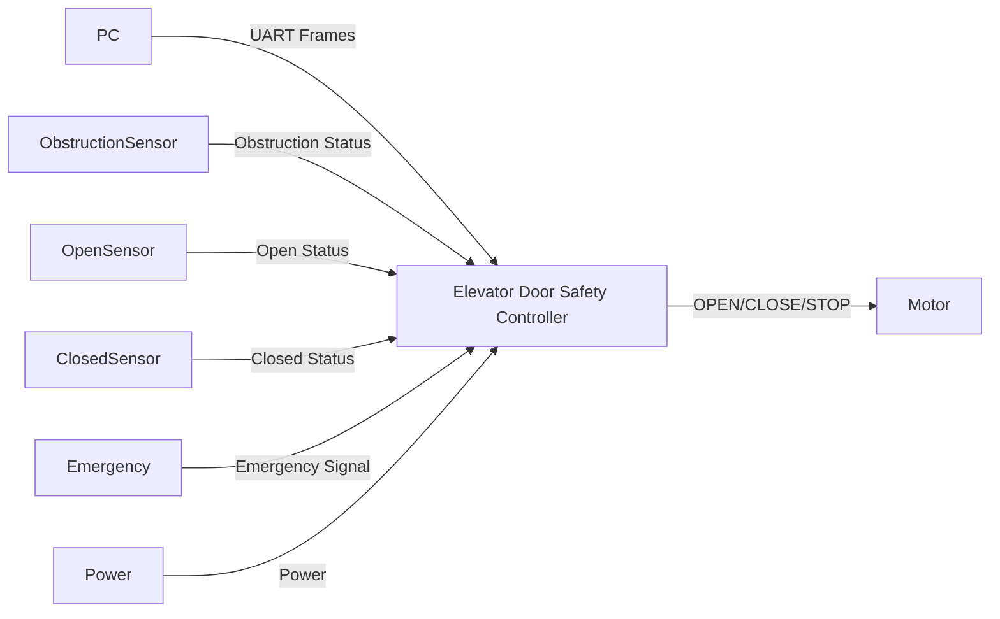
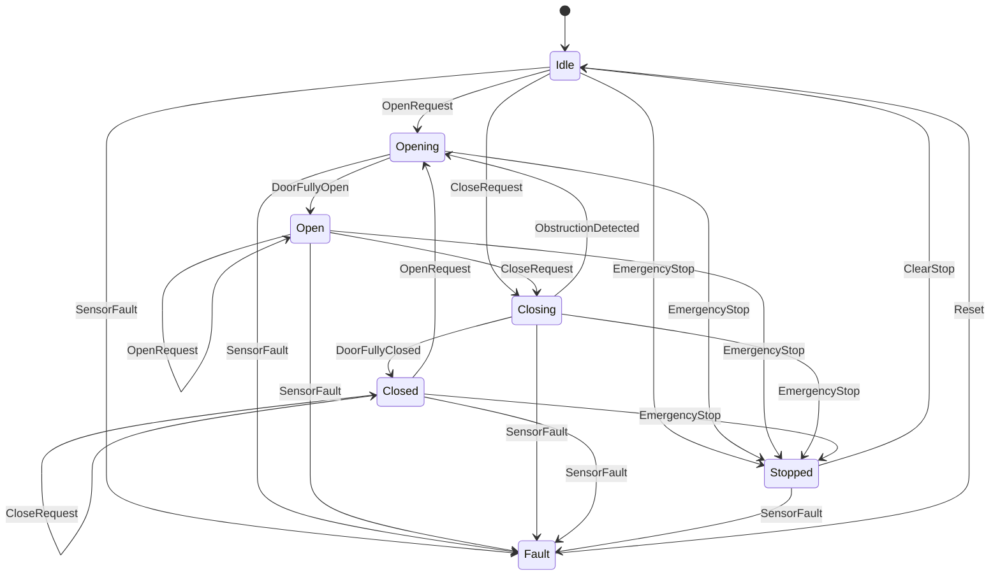

## System Boundary

### Inside the System
- Receive door-related commands and sensor data through UART
- Maintain internal door state (open, closed, opening, closing, stopped, fault)
- Decide when it is safe to open, close, or stop the door  
- Enforce safety interlocks (obstruction, sensor validity, emergency stop)
- Generate actuator commands: OPEN, CLOSE, STOP
- Detect abnormal or inconsistent inputs and transition to safe state

### Outside the System
- Passenger (person near the door)  
- PC terminal sending simulated UART commands
- Flow sensor
- Obstruction sensor
- Door sensor
- Emergency stop signal source
- Door motor / actuator 
- Power supply

### Assumptions
- UART messages may be delayed, missing, duplicated, or malformed
- Sensors may occasionally fail or provide incorrect data
- Elevator car is stationary and aligned with a floor  
- Door motor follows commands correctly  
- Human operator will investigate faults

---

## System Context

### Actors and Interfaces

| Actor / Entity | Type | Interface Description |
|---------------|------|-----------------------|
| PC Terminal | System | UART commands and simulated sensor frames |
| Passenger | User | Physical presence near door |
| Obstruction Sensor | Sensor | Obstruction detected / clear |
| Door Open Sensor | Sensor | Door fully open status |
| Door Closed Sensor | Sensor | Door fully closed status |
| Emergency Stop | Signal | Emergency stop active |
| Door Motor | Actuator | OPEN / CLOSE / STOP commands |
| Power Supply | System | Power presence / loss |

---

### System Context Diagram

## Selected Use Cases

| ID   | Use Case          | Actor            | Description                                      |
| ---- | ----------------- | ---------------- | ------------------------------------------------ |
| UC-1 | Open Door | User / PC Terminal | Request door to open safely |
| UC-2 | Close Door | User / PC Terminal | Request door to close safely |
| UC-3 | Handle Obstruction | Obstruction Sensor | Stop and reopen door when blocked |
| UC-4 | Emergency Stop | Emergency Signal | Immediately stop door motion |
| UC-5 | Handle Sensor Fault | Controller | Enter fault state on invalid data |

---

### Use Case Descriptions

#### UC-1: Open Door
- Goal: Open the elevator door safely.  
- Trigger: OPEN request received via UART.  
- Main Flow:  
  - Controller verifies no fault is present.  
  - Controller sends OPEN command to motor.  
  - Door moves until fully-open sensor is detected.  
- Outcome: System enters Open state.

#### UC-2: Close Door
- Goal: Close the elevator door safely.  
- Trigger: CLOSE request received via UART.  
- Main Flow:  
  - Controller checks that no obstruction is present.  
  - Controller sends CLOSE command to motor.  
  - Door moves until fully-closed sensor is detected.  
- Outcome: System enters Closed state.

#### UC-3: Handle Obstruction
- Goal: Prevent passenger injury or door damage.  
- Trigger: Obstruction detected while closing.  
- Main Flow:  
  - Controller sends STOP command.  
  - Controller sends OPEN command.  
- Outcome: Door reopens and enters Opening/Open state.

#### UC-4: Emergency Stop
- Goal: Immediately halt door movement.  
- Trigger: Emergency stop signal becomes active.  
- Main Flow:  
  - Controller sends STOP command.  
- Outcome: System enters Stopped state.

#### UC-5: Handle Sensor Fault
- Goal: Avoid unsafe behavior caused by bad sensor data.  
- Trigger: Invalid, missing, or contradictory sensor inputs.  
- Main Flow:  
  - Controller sends STOP command.  
  - Controller transitions to Fault state.  
- Outcome: Door remains stopped until reset.

---

## UML Statechart (Behavioral Model)

---
## Safety and Error Handling (Behavioral View)
- Obstruction always overrides closing.
- Emergency stop overrides all commands.
- Sensor faults force transition to Fault state.
- No motion commands are allowed in Fault state.
- Recovery requires explicit reset.
