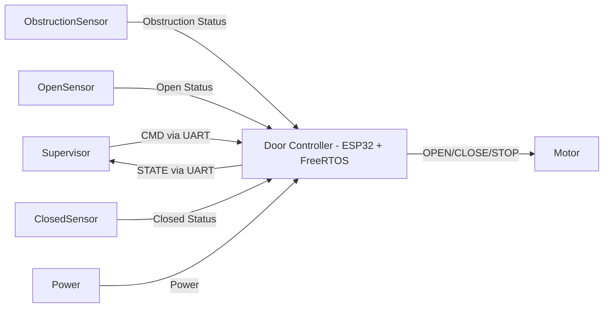
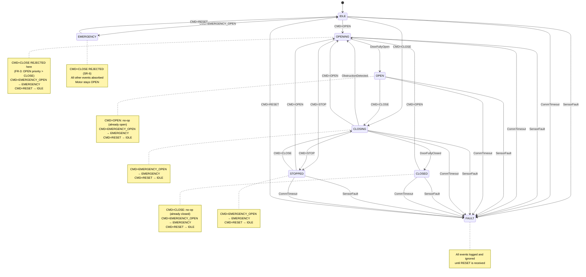

# Elevator Door Control System — System Model

---

## System Boundary

### Inside the System

- Receive command-based messages via UART from the Supervisor
- Maintain internal door state: `IDLE`, `OPENING`, `OPEN`, `CLOSING`, `CLOSED`, `STOPPED`, `EMERGENCY`, `FAULT`
- Execute FSM transitions deterministically
- Enforce safety interlocks:
  - Obstruction handling
  - Sensor validation
  - Communication timeout
  - Emergency override
- Generate actuator commands: `OPEN`, `CLOSE`, `STOP`
- Detect abnormal conditions and transition to safe states
- Provide state feedback and logging

### Outside the System

- Supervisor (Python simulation)
- Passenger (environment abstraction)
- Obstruction sensor (simulated)
- Door position sensors (simulated)
- Emergency trigger (via Supervisor command)
- Door motor / actuator
- Power supply

### Assumptions

- UART communication may be delayed, lost, duplicated, or corrupted
- Supervisor may send conflicting or invalid commands
- Sensors may be faulty or inconsistent
- Door actuator executes commands correctly
- System must remain safe even if the Supervisor behaves incorrectly

---

## System Context

### Actors and Interfaces

| Actor / Entity      | Type        | Interface Description                          |
|---------------------|-------------|------------------------------------------------|
| Supervisor (Python) | System      | Sends command frames, receives state updates   |
| Passenger           | Environment | Represents obstruction scenarios               |
| Obstruction Sensor  | Sensor      | Obstruction detected / clear                   |
| Door Open Sensor    | Sensor      | Door fully open                                |
| Door Closed Sensor  | Sensor      | Door fully closed                              |
| Door Motor          | Actuator    | `OPEN` / `CLOSE` / `STOP`                     |
| Power Supply        | System      | Power presence / reset                         |

---

### System Context Diagram


```mermaid
flowchart LR
    Supervisor -->|CMD via UART| Controller
    Controller -->|STATE via UART| Supervisor

    ObstructionSensor -->|Obstruction Status| Controller
    OpenSensor -->|Open Status| Controller
    ClosedSensor -->|Closed Status| Controller

    Controller -->|OPEN/CLOSE/STOP| Motor
    Power -->|Power| Controller

    Controller[Door Controller - ESP32 + FreeRTOS]
```

---

## Selected Use Cases

| ID   | Use Case              | Actor       | Description                                        |
|------|-----------------------|-------------|----------------------------------------------------|
| UC-1 | Open Door             | Supervisor  | Command door to open safely                        |
| UC-2 | Close Door            | Supervisor  | Command door to close safely                       |
| UC-3 | Handle Obstruction    | Sensor      | Reverse door during closing                        |
| UC-4 | Emergency Open        | Supervisor  | Override all active operations and open door       |
| UC-5 | Handle Fault          | Controller  | Enter safe state on invalid or missing conditions  |
| UC-6 | Communication Loss    | System      | Enter safe state on communication timeout          |
| UC-7 | Stop Door             | Supervisor  | Halt door motion in place (intermediate stop)      |

---

### Use Case Descriptions

#### UC-1: Open Door
- **Goal:** Open the elevator door safely.
- **Trigger:** `CMD=OPEN` received via UART.
- **Main Flow:**
  - Validate command and all safety constraints.
  - Transition to `OPENING`.
  - Door moves until the fully-open sensor is detected.
- **Outcome:** System enters `OPEN` state.

#### UC-2: Close Door
- **Goal:** Close the elevator door safely.
- **Trigger:** `CMD=CLOSE` received via UART.
- **Precondition:** Door must NOT be in `OPENING` state (OPEN priority > CLOSE per FR-3).
- **Main Flow:**
  - Validate that no obstruction is present.
  - Transition to `CLOSING`.
  - Door moves until the fully-closed sensor is detected.
- **Outcome:** System enters `CLOSED` state.

#### UC-3: Handle Obstruction
- **Goal:** Prevent passenger injury or door damage.
- **Trigger:** Obstruction detected while door is closing.
- **Main Flow:**
  - Controller sends `STOP` command.
  - Controller sends `OPEN` command.
- **Outcome:** Door reopens and system enters `OPENING` / `OPEN` state.

#### UC-4: Emergency Open
- **Goal:** Immediately open the door regardless of current state.
- **Trigger:** `CMD=EMERGENCY_OPEN` received via UART.
- **Main Flow:**
  - Interrupt any active operation.
  - Transition to `EMERGENCY` (motor opens) within a bounded time.
  - Door remains open and in EMERGENCY until an explicit `RESET` is received.
- **Outcome:** System enters `EMERGENCY` state and holds until `RESET`.

#### UC-5: Handle Fault
- **Goal:** Avoid unsafe behavior caused by invalid or missing sensor data.
- **Trigger:** Invalid, missing, or contradictory sensor inputs, or a system error.
- **Main Flow:**
  - Controller sends `STOP` command.
  - Controller transitions to `FAULT` state.
- **Outcome:** Door remains stopped; no motion allowed until explicit `RESET`.

#### UC-6: Communication Loss
- **Goal:** Maintain safe state when the Supervisor becomes unreachable.
- **Trigger:** No valid command received within `COMM_TIMEOUT_MS` (configurable; production target: 100 ms).
- **Main Flow:**
  - Controller sends `STOP` command.
  - Controller transitions to `FAULT` state.
- **Outcome:** Door remains stopped; system waits for communication to be restored.

#### UC-7: Stop Door
- **Goal:** Halt the door at its current position on operator command.
- **Trigger:** `CMD=STOP` received during `OPENING` or `CLOSING`.
- **Main Flow:**
  - Controller sends `STOP` command to motor.
  - Transition to `STOPPED` state.
- **Outcome:** Door halted at intermediate position; resumes on next `CMD=OPEN` or `CMD=CLOSE`.

---

## UML Statechart (Behavioral Model)

### Command Priority Rule (FR-3)
```
EMERGENCY_OPEN  >  OPEN  >  CLOSE
```
- `CMD=EMERGENCY_OPEN` overrides **any** active state.
- `CMD=OPEN` overrides `CLOSING` (OPEN preempts CLOSE).
- `CMD=CLOSE` is **rejected** during `OPENING` (OPEN takes precedence).
- `CMD=RESET` recovers from **any** state (including `FAULT` and `EMERGENCY`) to `IDLE`.


```mermaid
stateDiagram-v2
    [*] --> IDLE

    %% -----------------------
    %% IDLE
    %% -----------------------
    IDLE --> OPENING   : CMD=OPEN
    IDLE --> CLOSING   : CMD=CLOSE
    IDLE --> EMERGENCY : CMD=EMERGENCY_OPEN
    IDLE --> FAULT     : SensorFault
    IDLE --> FAULT     : CommTimeout

    %% -----------------------
    %% OPENING
    %% -----------------------
    OPENING --> OPEN      : DoorFullyOpen
    OPENING --> STOPPED   : CMD=STOP
    OPENING --> FAULT     : SensorFault
    OPENING --> FAULT     : CommTimeout
    note right of OPENING
      CMD=CLOSE REJECTED here
      (FR-3: OPEN priority > CLOSE)
      CMD=EMERGENCY_OPEN → EMERGENCY
      CMD=RESET → IDLE
    end note

    %% -----------------------
    %% OPEN
    %% -----------------------
    OPEN --> CLOSING   : CMD=CLOSE
    OPEN --> FAULT     : SensorFault
    OPEN --> FAULT     : CommTimeout
    note right of OPEN
      CMD=OPEN: no-op (already open)
      CMD=EMERGENCY_OPEN → EMERGENCY
      CMD=RESET → IDLE
    end note

    %% -----------------------
    %% CLOSING
    %% -----------------------
    CLOSING --> CLOSED   : DoorFullyClosed
    CLOSING --> OPENING  : ObstructionDetected
    CLOSING --> OPENING  : CMD=OPEN
    CLOSING --> STOPPED  : CMD=STOP
    CLOSING --> FAULT    : SensorFault
    CLOSING --> FAULT    : CommTimeout
    note right of CLOSING
      CMD=EMERGENCY_OPEN → EMERGENCY
      CMD=RESET → IDLE
    end note

    %% -----------------------
    %% CLOSED
    %% -----------------------
    CLOSED --> OPENING : CMD=OPEN
    CLOSED --> FAULT   : SensorFault
    CLOSED --> FAULT   : CommTimeout
    note right of CLOSED
      CMD=CLOSE: no-op (already closed)
      CMD=EMERGENCY_OPEN → EMERGENCY
      CMD=RESET → IDLE
    end note

    %% -----------------------
    %% STOPPED
    %% -----------------------
    STOPPED --> OPENING : CMD=OPEN
    STOPPED --> CLOSING : CMD=CLOSE
    STOPPED --> FAULT   : SensorFault
    STOPPED --> FAULT   : CommTimeout
    note right of STOPPED
      CMD=EMERGENCY_OPEN → EMERGENCY
      CMD=RESET → IDLE
    end note

    %% -----------------------
    %% EMERGENCY (holds OPEN; only RESET exits)
    %% -----------------------
    EMERGENCY --> IDLE : CMD=RESET
    note right of EMERGENCY
      CMD=CLOSE REJECTED (SR-6)
      All other events absorbed
      Motor stays OPEN
    end note

    %% -----------------------
    %% FAULT (no motion; only RESET exits)
    %% -----------------------
    FAULT --> IDLE : CMD=RESET
    note right of FAULT
      All events logged and ignored
      until RESET is received
    end note
```

---

## Safety and Error Handling (Behavioral View)

- `CMD=EMERGENCY_OPEN` overrides **all** active states immediately — no state is exempt.
- Obstruction always overrides closing immediately (`CLOSING` → `OPENING`).
- `CMD=CLOSE` is rejected (not queued) during `OPENING`; FR-3 priority rule.
- Sensor faults force transition to `FAULT` state from any state.
- Communication timeout (configurable threshold) forces transition to `FAULT` from any state except `FAULT` and `EMERGENCY`.
- No motion commands are permitted while in `FAULT` state.
- Recovery requires an explicit `RESET` command.
- The system never auto-resumes motion after `RESET` or power restoration (SR-4).
- `EMERGENCY` holds the door open until explicit `RESET`; `CMD=CLOSE` is explicitly rejected.

---

## State Summary

| State       | Motor    | Entry From                               | Exits To                                   |
|-------------|----------|------------------------------------------|--------------------------------------------|
| `IDLE`      | STOP     | Power-on / RESET                         | `OPENING`, `CLOSING`, `FAULT`, `EMERGENCY` |
| `OPENING`   | OPEN     | `IDLE`, `CLOSING`, `CLOSED`, `STOPPED`   | `OPEN`, `STOPPED`, `FAULT`, `EMERGENCY`    |
| `OPEN`      | STOP     | `OPENING`                                | `CLOSING`, `FAULT`, `EMERGENCY`, `IDLE`    |
| `CLOSING`   | CLOSE    | `OPEN`, `STOPPED`                        | `CLOSED`, `OPENING`, `STOPPED`, `FAULT`, `EMERGENCY` |
| `CLOSED`    | STOP     | `CLOSING`                                | `OPENING`, `FAULT`, `EMERGENCY`, `IDLE`    |
| `STOPPED`   | STOP     | `OPENING`, `CLOSING`                     | `OPENING`, `CLOSING`, `FAULT`, `EMERGENCY`, `IDLE` |
| `EMERGENCY` | OPEN     | Any state (EMERGENCY_OPEN command)       | `IDLE` (RESET only)                        |
| `FAULT`     | STOP     | Any state (fault event)                  | `IDLE` (RESET only)                        |
